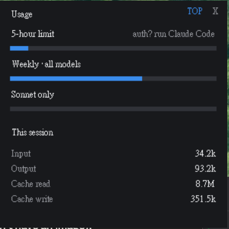

# claudeTokenMonitor

A tiny always-on-top Windows desktop widget that shows your **Claude Code usage** in real time — the same numbers as the `/usage` panel, plus a per-session token breakdown.

## What it shows

- **5-hour limit**, **Weekly (all models)**, **Sonnet only** — official utilization % and reset times, pulled live from Anthropic's usage endpoint (`/api/oauth/usage`, the same source `/usage` uses).
- **This session** — Input / Output / Cache read / Cache write token counts, read from the most recently active local transcript (deduped by message id).

## Requirements

- Windows + Windows PowerShell 5.1
- Claude Code installed and logged in (the widget reads your OAuth token from `~/.claude/.credentials.json`; nothing is stored or sent anywhere except Anthropic's own API)

## Usage

- Double-click **`桌面小工具.vbs`** to launch (no console window).
- Double-click **`全部關閉.cmd`** to close all running instances.
- **Drag** to move, **right-click** or **X** to close, **TOP** toggles always-on-top.

Auto-start on login: drop a shortcut to `桌面小工具.vbs` into `shell:startup`.

## Notes

- The token is read fresh on every poll (every 15s), so when Claude Code refreshes it the widget keeps working. If it expires and isn't refreshed, the widget shows `auth? run Claude Code`.
- "This session" matches `/usage` only at the same instant — it keeps changing as you work.

## How it works

`widget.ps1` is a single PowerShell + WinForms script. No dependencies, no install.
